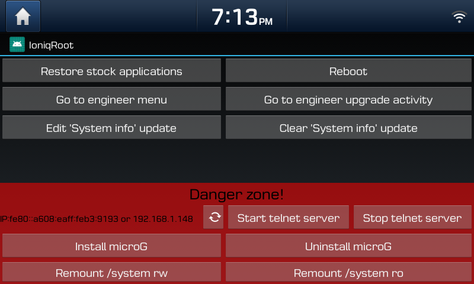

# IoniqRoot

```diff
- WARNING: This will disable fastboot mode!
- The head unit will take more time to boot and it's possible that apps are starting slower.
- Only reflashing the stock firmware will bring back fastboot.
```

Brings back stock Settings and Browser applications to your Hyundai Ioniq (28 kWh) running 191209 firmware. <br />

**Features:<br  />**
* Launches on double press of settings button
* Restores stock Settings, Package installer and Browser applications
* Allows you to enter full Engineering Mode
* Go to password protected upgrade activity in Engineering Mode
* Allows you to edit the update timestamp of Settings -> System info
* DANGER ZONE:
* Allows you to install microG
* Opens root shell telnet server
* Mount system partition read & write or read only



If you like my work I'd be happy if you buy me a coffee. Thanks!<br  />
[](https://www.paypal.com/cgi-bin/webscr?cmd=_s-xclick&hosted_button_id=RT8WTFDGMLFPG)
