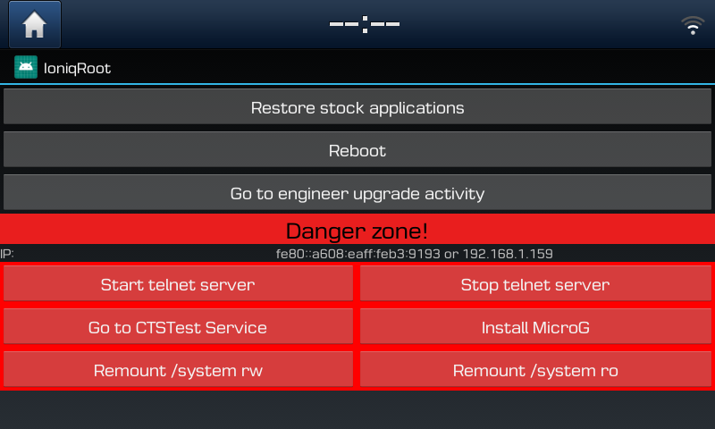

# IoniqRoot
Brings back stock Settings and Browser applications to your Hyundai Ioniq (28 kWh) running 191209 firmware.  

**Features: **
* Restores stock Settings and Browser applications
* Allows you to install MicroG 
* Root telnet server
* Go to password protected upgrade activity in Engineering Mode
* Mount system partition read & write or read only

